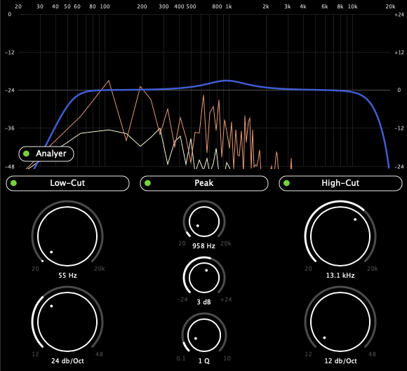

# Simple JUCE EQ



## Description

Simple equalizer built with [JUCE](https://juce.com/) framework from following this tutorial:

[Learn Modern C++ by Building an Audio Plugin (w/ JUCE Framework)](https://www.youtube.com/watch?v=i_Iq4_Kd7Rc&ab_channel=freeCodeCamp.org)

## Instructions

ProJucer wipes data such as plist info
Run the following to insert missing properties:
```
python3 Scripts/insert_plist_settings.py
```
For Mac, copy Product folder files (vst3, component) to Mac-OS plugin path: /Library/Audio/Plug-Ins

## Credits

#### Matkat Music 
- [github](https://github.com/matkatmusic)
- [SimpleEQ project](https://github.com/matkatmusic/SimpleEQ)
- [Instagram](https://www.instagram.com/matkatmusic)

## Author

- [Jason Fleischer](https://jasonfleischer.github.io/website/)
